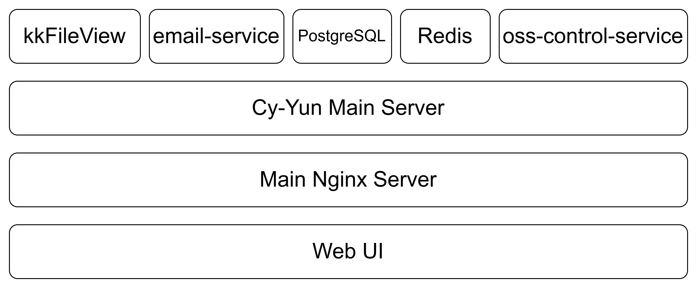

# cy-yun-app
云笔记网盘APP

- 各个文件和文件夹说明
  - cloudAndFiles：Python主后台源码
  - cy-yun-front：前端React源码
  - email-service：邮件服务源码
  - oss-control-service：阿里云OSS访问服务源码
  - email-service.service：邮件服务Linux服务注册配置文件
  - oss-control-service.service：阿里云OSS访问服务Linux服务注册配置文件

## 1 模块基本设计

### 1.1 文件预览模块

- 在服务器中部署`kkFileView`提供预览服务模块
- 模块访问为`/file-preview/onlinePreview?url={url}`，需要一个参数，url为文件路径，可以使用云服务平台的对象存储提供的链接
  - `url`需要使用`encodeURIComponent(Base64.encode(url)))`转义
  - `https://cdn.jsdelivr.net/npm/js-base64@3.6.0/base64.min.js`提供了函数`Base64.encode`
  - 在`kkFileView`的配置文件中，`base.url`的链接得配置为面向公网的路径，由于添加了`nginx`反向代理，因此配置为`https://ying2233.cn/file-preview`
  - 对象存储提供的链接的域名需要添加在`kkFileView`配置文件中的`trust.host`中，防止恶意访问
- 大部分存储在对象存储的文件，都将由该文件预览模块提供预览支持，pdf、execl、word、txt、md文件，图片预览等都提供支持

### 1.2 文件管理模块

- 设计一个表，为`cloudfiles`，该表中存储所有用户上传的文件或创建的文件夹
  - 该表首先得区分用户，并建立文件夹和文件夹与文件之间的层级关系
  - 表中存储文件名和文件所存储在阿里云对象存储OSS中的真实路径
- 所有文件的真实路径所用的文件名需要经过特殊处理，保证唯一性，且OSS存储的路径设为`userId/yyyy/mm/dd/处理后的文件名.扩展名`
- 删除时给文件的删除时刻填入当前时刻，一个月后将被自动删除
- 文件在线编辑
  - 在前端页面集成了文本编辑器，可以任意新建文件，前端新建的文件（非上传文件）均会被标注为online_editable为True
  - 在线编辑文件的内容存储于表`filecontent`中，使用文件id与表`cloudfiles`关联

### 1.3 用户管理模块

- 用户注册、登录、忘记密码、重置密码、验证码发送均在此实现
- 提供全用户列表查询以及用户状态、内存可用调整等API，由管理员页面操控，API均需要管理员权限才能调用
- 提供用户更新用户名、邮箱的功能，邮箱更新时需要验证码

### 1.4 系统设置模块

- 提供以下访问接口
  - 调用阿里云OSS访问模块查询当前Bucket已上传文件数与总内存
  - 表`system_config`中`register_enable`参数的访问与修改，控制是否允许新用户注册

### 1.5 阿里云OSS访问模块

- 设计为一个服务，注册于`/etc/systemd/system`中，后续使用`sudo systemctl start oss-control-service.service`控制启动

- 由于阿里云OSS的python-jdk已经多年未更新，无法兼容`python3.12`，因此使用社区较为活跃的nodejs的jdk，`ali-oss`，将所有OSS操作都由nodejs完成，并通过`express.js`向外提供操作Api，供python业务主后台操作

### 1.6 邮件发送模块

- 主要用于验证码发送和通知发送
- 设计为一个服务，注册于`/etc/systemd/system`中，后续使用`sudo systemctl start mail-service.service`控制启动

## 2 表设计

- 主要关系型数据库使用`PostgreSQL`

### 2.1 文件与文件夹关系表

- `id`和`parent_id`组建起文件夹的层级结构，根目录的`parent_id`为空
- 删除时`deleted_at`存入当前时间，暂不物理删除

```sql
CREATE EXTENSION IF NOT EXISTS "pgcrypto"; -- 添加函数支持

-- 文件与文件夹关系表
CREATE TABLE cloudfiles (
    id UUID PRIMARY KEY DEFAULT gen_random_uuid(),
    user_id TEXT NOT NULL,
    name TEXT NOT NULL,
    is_folder BOOLEAN NOT NULL,
    parent_id UUID,
    oss_path TEXT,
    size BIGINT,
    created_at TIMESTAMP DEFAULT NOW(),
    updated_at TIMESTAMP DEFAULT NOW(),
    deleted_at TIMESTAMP DEFAULT NULL,
    file_suffix TEXT
);

CREATE INDEX idx_files_user_id ON cloudfiles(user_id);
CREATE INDEX idx_files_parent_id ON cloudfiles(parent_id);
CREATE INDEX idx_files_deleted_at ON cloudfiles(deleted_at);
CREATE INDEX idx_files_user_deleted ON cloudfiles(user_id, deleted_at);
CREATE UNIQUE INDEX uq_files_path_name ON cloudfiles(user_id, parent_id, name);
```

### 2.2 可在线编辑文件内容表

- 可编辑文件的文件内容存储于`content`中，md、txt以及别的代码类的文件都提供支持
- `id`与表`cloudfiles`中的`id`保持一致
- 删除时`deleted_at`存入当前时间，暂不物理删除

```sql
-- 可在线编辑文件内容表
CREATE TABLE filecontent (
    id UUID PRIMARY KEY,
    name TEXT NOT NULL,
    content TEXT,
    user_id TEXT NOT NULL,
    file_suffix TEXT,
    updated_at TIMESTAMP DEFAULT NOW(),
    created_at TIMESTAMP DEFAULT NOW(),
    deleted_at TIMESTAMP DEFAULT NULL
);

-- 添加索引
CREATE INDEX idx_filecontent_id ON filecontent(id);
CREATE INDEX idx_filecontent_user_id ON filecontent(user_id);
CREATE INDEX idx_filecontent_deleted_at ON filecontent(deleted_at);
CREATE INDEX idx_filecontent_file_suffix ON filecontent(file_suffix);
```

### 2.3 用户表

- 用户id和`user_id`关联
- 删除时`deleted_at`存入当前时间，暂不物理删除
- `user_group`中，暂时设置`admin`，`user`两种，作为权限区分

```sql
-- 用户表
CREATE TABLE users (
    user_id TEXT PRIMARY KEY,
    email TEXT NOT NULL UNIQUE,
    password TEXT NOT NULL,
    user_group TEXT,
    is_active BOOLEAN NOT NULL DEFAULT TRUE,
    created_at TIMESTAMP DEFAULT NOW(),
    updated_at TIMESTAMP DEFAULT NOW(),
    deleted_at TIMESTAMP DEFAULT NULL
);

-- 添加索引
CREATE INDEX idx_users_user_id ON users(user_id);
CREATE INDEX idx_users_email ON users(email);
CREATE INDEX idx_users_user_group ON users(user_group);
CREATE INDEX idx_users_is_active ON users(is_active);
CREATE INDEX idx_users_deleted_at ON users(deleted_at);
```

### 2.4 用户存储配额表

- 每个用户一条记录（`user_id` 作为主键和外键）；

- 单位使用字节（`TEXT`），Python中使用`decimal.Decimal`来处理；

- 可追踪创建/更新时间；

- 支持未来扩展（如总容量、免费/付费容量等）；

```sql
CREATE TABLE user_storage_quota (
    user_id TEXT PRIMARY KEY,
    online_edit_limit TEXT NOT NULL DEFAULT '134217728',   -- 在线编辑容量上限（单位：字节）128MB
    upload_limit TEXT NOT NULL DEFAULT '1073741824',       -- 上传容量上限
    online_edit_used TEXT NOT NULL DEFAULT '0',            -- 已使用在线编辑容量
    upload_used TEXT NOT NULL DEFAULT '0',                 -- 已使用上传容量
    created_at TIMESTAMP DEFAULT NOW(),
    updated_at TIMESTAMP DEFAULT NOW()
);

-- 索引
CREATE INDEX idx_user_storage_quota_user_id ON user_storage_quota(user_id);
```

### 2.5 系统配置表

- `<config_key, config_value>`的方式形成kv数据库
- 目前暂时添加参数`register_enable`，`1`则允新许用户注册，`0`则禁止新用户注册

```sql
CREATE TABLE system_config (
    config_key TEXT PRIMARY KEY,
    config_value TEXT NOT NULL,
    created_at TIMESTAMP DEFAULT NOW(),
    updated_at TIMESTAMP DEFAULT NOW()
);

-- 索引
CREATE INDEX idx_system_config_config_key ON system_config(config_key);
```

## 3 整体架构

- 整个项目的整体服务架构如图
  - 关系型数据库使用`PostgreSQL`
  - 缓存数据库使用`key:value`数据库`Redis`
  - 微服务组件，邮件组件`email-service`，由`node.js`构建
  - 微服务组件，阿里云OSS访问组件`oss-control-service`，由`node.js`构建
  - 微服务组件，文件预览组件`kkFileView`，由`spring-boot`构建，参考如下
    - [kkFileView](https://github.com/kekingcn/kkFileView) ：`GitHub Page`
    - [kkFileView官网](https://kkview.cn/zh-cn/index.html) ：`kkFileView`官网

  

## 4 微服务端API设计

### 4.1 oss-control-service阿里云OSS访问服务

#### 4.1.1 获取临时 URL：`/get-url`

**方法**：`GET`

**参数（Query）**：

- `filePath`: `str` - 必填，OSS 中的文件路径。
- `expires`: `int | None` - 可选，URL 的有效期（秒），默认值为 `3600`。
- `downloadFlag`: `int | None` - 可选，是否生成下载链接，`1`=下载链接，`0`=普通访问链接，默认值为 `0`。
- `fileName`: `str | None` - 可选，下载链接的文件名，`downloadFlag=1` 时生效。

**返回**：

- `url`: `str` - 生成的临时访问 URL。

**错误**：

- `400`: 缺少 `filePath` 参数。
- `500`: URL 生成失败，返回错误信息。

**示例**：

请求：

```http
GET /get-url?filePath=example-folder/example-file.txt&expires=3600&downloadFlag=1&fileName=test.txt
```

返回：

```json
{
  "url": "https://example-bucket.oss-cn-region.aliyuncs.com/example-folder/example-file.txt?..."
}
```

---

#### 4.1.2 获取 STS 临时凭证：`/get-sts`

**方法**：`GET`

**参数（Query）**：

- `expires`: `int | None` - 可选，临时凭证的有效期（秒），默认值为 `3600`。

**返回**：

- `accessKeyId`: `str` - 临时凭证的 AccessKeyId。
- `accessKeySecret`: `str` - 临时凭证的 AccessKeySecret。
- `securityToken`: `str` - 临时凭证的 SecurityToken。
- `expiration`: `str` - 凭证的过期时间。

**错误**：

- `500`: 临时凭证生成失败，返回错误信息。

**示例**：

请求：

```http
GET /get-sts?expires=3600
```

返回：

```json
{
  "accessKeyId": "STS.xxxxx",
  "accessKeySecret": "xxxxxx",
  "securityToken": "xxxxxx",
  "expiration": "2025-06-13T12:00:00Z"
}
```

---

#### 4.1.3 获取 BUCKET 容量统计：`/get-bucket-stat`

**方法**：`GET`

**参数**：无

**返回**：

- `storageUsed`: `int` - 已使用的存储容量（字节）。
- `objectCount`: `int` - 存储桶中的对象数量。

**错误**：

- `500`: 获取存储统计信息失败，返回错误信息。

**示例**：

请求：

```http
GET /get-bucket-stat
```

返回：

```json
{
  "storageUsed": 123456789,
  "objectCount": 100
}
```

---

#### 4.1.4 删除文件：`/delete-file`

**方法**：`GET`

**参数（Query）**：

- `filePath`: `str` - 必填，OSS 中需要删除的文件路径。

**返回**：

- `result`: `Dict` - 删除操作的结果，包含以下字段：
  - `res`: `Dict` - OSS 返回的响应信息，通常包含 HTTP 状态码等。

**错误**：

- `400`: 缺少 `filePath` 参数。
- `500`: 删除失败，返回错误信息。

**示例**：

请求：

```http
GET /delete-file?filePath=example-folder/example-file.txt
```

返回：

```json
{
  "result": {
    "res": {
      "status": 204,
      "headers": {
        "x-oss-request-id": "5F4E8A8B12345678",
        "date": "Fri, 13 Jun 2025 12:00:00 GMT",
        "content-length": "0"
      }
    }
  }
}
```

### 4.2 email-service邮件服务

#### 4.2.1 发送邮件：`/send-email`

**方法**：`POST`

**参数（Body）**：

- `to`: `str` - 必填，收件人的邮箱地址。
- `subject`: `str` - 必填，邮件的主题。
- `html`: `str` - 必填，邮件的 HTML 内容。

**返回**：

- `message`: `str` - 邮件发送请求的状态信息。

**错误**：

- `400`: 缺少 `to`、`subject` 或 `html` 参数。
- `500`: 邮件发送失败，返回错误信息（在 mail.js 中记录）。

**示例**：

请求：

```http
POST /send-email
Content-Type: application/json

{
  "to": "example@example.com",
  "subject": "测试邮件",
  "html": "<h1>这是测试邮件的内容</h1>"
}
```

返回：

```json
{
  "message": "邮件发送请求已接收，正在处理中"
}
```

## 5 主后台API设计

### 5.1 文件系统

#### 5.1.1 文件列表：`/file-management/file-list/`

**方法**：`GET`

**参数（Query）**：

- `parent_id`: `str | None` - 父文件夹ID，若为空则为根目录；
- `type_id`: `str | None` - 文件类型：`1`=文件，`2`=文件夹，未传返回全部。

**返回**：

- `items`: `List[Dict]` - 当前用户在指定目录下的文件/文件夹列表，每项包含：
  - `id`: `str` - 文件/文件夹ID
  - `name`: `str` - 名称
  - `is_folder`: `bool` - 是否为文件夹
  - `parent_id`: `str | None` - 父文件夹ID
  - `oss_path`: `str | None` - OSS路径（文件有，文件夹无）
  - `size`: `int | None` - 文件大小（字节）
  - `created_at`: `str` - 创建时间
  - `updated_at`: `str` - 更新时间
  - `file_suffix`: `str | None` - 文件后缀
  - `online_editable`: `bool` - 是否可在线编辑
- `total`: `int` - 文件/文件夹总数

---

#### 5.1.2 回收站：`/file-management/recycle-bin/`

**方法**：`GET`

**参数（Query）**：

- `offset`: `int` - 起始位置，默认0
- `limit`: `int` - 返回条数，默认10

**返回**：

- `items`: `List[Dict]` - 当前用户被逻辑删除的文件/文件夹列表，字段同上
- `total`: `int` - 当前用户被逻辑删除的文件/文件夹总数

---

#### 5.1.3 最近文件：`/file-management/get-recent-files/`

**方法**：`GET`

**参数**：无

**返回**：

- `items`: `List[Dict]` - 当前用户最近修改的文件列表（最多20条），字段同文件列表

---

#### 5.1.4 文件查找：`/file-management/find-file/`

**方法**：`GET`

**参数（Query）**：

- `fileId`: `str | None` - 文件或文件夹ID
- `fileName`: `str | None` - 文件或文件夹名称，支持模糊搜索

**返回**：

- `items`: `List[Dict]` - 匹配的文件/文件夹信息，字段同文件列表
- `full_path`: `str` - 完整路径（如“根目录/项目/文件.txt”）
- `filePath`: `List[Dict]` - 路径节点列表（每项含`id`、`name`）

---

#### 5.1.5 对象存储临时凭证：`/file-management/get-sts/`

**方法**：`GET`

**参数**：无

**返回**：

- `accessKeyId`: `str`
- `accessKeySecret`: `str`
- `securityToken`: `str`
- `expiration`: `str`
- 及其他OSS临时凭证相关字段

---

#### 5.1.6 新建文件：`/file-management/insert-file/`

**方法**：`POST`

**参数（JSON）**：

- `fileName`: `str` - 文件或文件夹名称
- `parentId`: `str | None` - 父目录ID
- `filePath`: `str | None` - OSS路径
- `fileSize`: `int | None` - 文件大小

**返回**：

- `id`: `str` - 新建文件/文件夹ID
- `name`: `str`
- 其他同文件列表

---

#### 5.1.7 在线编辑文件内容返回：`/file-management/get-online-edit-file/`

**方法**：`POST`

**参数（JSON）**：

- `fileId`: `str` - 文件ID

**返回**：

- `id`: `str`
- `name`: `str`
- `content`: `str` - 文件内容
- `file_suffix`: `str`
- `updated_at`: `str`
- 其他同文件列表

---

#### 5.1.8 新建在线编辑文件：`/file-management/insert-online-edit-file/`

**方法**：`POST`

**参数（JSON）**：

- `fileName`: `str` - 文件名称
- `folderId`: `str | None` - 父目录ID
- `content`: `str` - 文件内容
- `fileSize`: `int` - 文件大小

**返回**：

- `id`: `str`
- `name`: `str`
- `content`: `str`
- `file_suffix`: `str`
- `created_at`: `str`
- 其他同文件列表

---

#### 5.1.9 更新在线编辑文件：`/file-management/update-online-edit-file/`

**方法**：`POST`

**参数（JSON）**：

- `fileId`: `str` - 文件ID
- `content`: `str` - 更新后的内容
- `fileSize`: `int` - 文件大小

**返回**：

- `id`: `str`
- `name`: `str`
- `content`: `str`
- `updated_at`: `str`
- 其他同文件列表

---

#### 5.1.10 在线预览文件临时路径：`/file-management/get-preview-temp-path/`

**方法**：`GET`

**参数（Query）**：

- `ossPath`: `str` - OSS路径

**返回**：

- `tempUrl`: `str` - 预览文件的临时URL（10分钟有效）

---

#### 5.1.11 删除文件/文件夹：`/file-management/delete-file/`

**方法**：`POST`

**参数（JSON）**：

- `id`: `str` - 文件或文件夹ID

**返回**：

- `deleted_ids`: `List[str]` - 实际被逻辑删除的对象ID（含递归子项）
- `success`: `bool`
- `message`: `str`

---

#### 5.1.12 物理删除文件/文件夹：`/file-management/hard-delete-file/`

**方法**：`POST`

**参数（JSON）**：

- `id`: `str` - 文件或文件夹ID

**返回**：

- `deleted_ids`: `List[str]` - 实际被物理删除的对象ID（含递归子项）
- `success`: `bool`
- `message`: `str`

---

#### 5.1.13 创建文件夹：`/file-management/create-folder/`

**方法**：`POST`

**参数（JSON）**：

- `name`: `str` - 要创建的文件夹名称
- `parentId`: `str | None` - 父文件夹ID，`None`为根目录

**返回**：

- `id`: `str` - 新建文件夹ID
- `name`: `str`
- `parent_id`: `str | None`
- `created_at`: `str`
- 其他同文件列表

---

#### 5.1.14 文件/文件夹移动：`/file-management/move-file/`

**方法**：`POST`

**参数（JSON）**：

- `id`: `str` - 要移动的文件或文件夹ID
- `newParentId`: `str | None` - 新父文件夹ID，`None`为根目录

**返回**：

- `moved_ids`: `List[str]` - 实际被移动的对象ID（含递归子项）
- `success`: `bool`
- `message`: `str`

---

#### 5.1.15 文件/文件夹恢复：`/file-management/restore/`

**方法**：`POST`

**参数（JSON）**：

- `id`: `str` - 要恢复的文件或文件夹ID

**返回**：

- `full_path`: `str` - 恢复后的完整路径（如“根目录/项目/文件.txt”）
- `filePath`: `List[Dict]` - 父目录路径列表（每项含`id`、`name`）
- `recovered_ids`: `List[str]` - 实际被恢复的对象ID（含递归子项）
- `success`: `bool`
- `message`: `str`

---

#### 5.1.16 文件/文件夹重命名：`/file-management/rename/`

**方法**：`POST`

**参数（JSON）**：

- `id`: `str` - 要重命名的文件或文件夹ID
- `newName`: `str` - 新名称

**返回**：

- `id`: `str`
- `name`: `str` - 新名称
- `updated_at`: `str`
- 其他同文件列表
- `success`: `bool`
- `message`: `str`

#### 5.1.17 生成下载链接：`/file-management/download-generate/`

**方法**：`GET`

**参数**：
- `fileId`: `str` - 文件ID。

**返回**：
- `tempUrl`: `str` - 文件的临时下载链接（10分钟有效，在线编辑文件为平台自有下载链接）。

#### 5.1.18 下载在线编辑文件：`/file-management/download-file/`

**方法**：`GET`

**参数**：
- `key`: `str` - 下载密钥（通过 `/download-generate/` 或 `/share-page/` 获取）。

**返回**：
- 以附件形式下载在线编辑文件内容。

#### 5.1.19 生成文件分享链接：`/file-management/share-file/`

**方法**：`GET`

**参数**：
- `fileId`: `str` - 文件ID。

**返回**：
- `shareUrl`: `str` - 文件分享页面的访问链接（7天有效）。

#### 5.1.20 文件分享页面：`/file-management/share-page/`

**方法**：`GET`

**参数**：
- `key`: `str` - 分享密钥（通过 `/share-file/` 获取）。

**返回**：
- 渲染的文件分享页面（HTML），包含下载按钮或错误提示。

### 5.2 用户相关

#### 5.2.1 用户登录：/user-management/login/

**方法**：POST

**参数（JSON）**：

- email: str - 用户邮箱；
- password: str - 用户密码。

**返回**：登录结果，包括：

- yunId: str - 用户唯一 ID；
- userName: str - 用户名；
- email: str - 邮箱；
- userGroup: str - 用户组（如 user, admin）；
- 设置了访问令牌（access token）的 Cookie。

#### 5.2.2 用户登出：/user-management/logout/

**方法**：POST

**权限要求**：已登录（JWT）

**参数**：无

**返回**：登出成功或失败信息，清除 Cookie 中的访问令牌。

#### 5.2.3 用户注册：/user-management/register/

**方法**：POST

**参数（JSON）**：

- captchaId: str - 验证码 ID；
- captchaCode: str - 验证码；
- email: str - 用户邮箱；
- password: str - 密码（8~50 位）；
- password2: str - 确认密码。

**返回**：注册成功后返回：

- yunId: str - 用户 ID；
- userName: str - 用户名（邮箱前缀）；
- email: str - 邮箱；
- userGroup: str - 默认用户组；
- 设置访问令牌（access token）。

#### 5.2.4 获取验证码（注册/邮箱绑定）：/user-management/get-captcha/

**方法**：GET

**参数（Query 或 JSON）**：

- email: str - 邮箱地址。

**返回**：

- captchaId: str - 验证码 ID，用于后续验证；
- 验证码通过邮件发送。

#### 5.2.5 登录用户获取验证码（修改邮箱）：/user-management/user-get-captcha/

**方法**：GET

**权限要求**：已登录（JWT）

**参数**：无

**返回**：

- captchaId: str - 验证码 ID；
- 验证码通过绑定邮箱发送。

#### 5.2.6 获取用户存储配额信息：/user-management/user-storage-quota/

**方法**：GET

**权限要求**：已登录（JWT）

**参数**：无

**返回**：

- 用户存储配额信息，包括：
  - uploadLimit: str - 上传限额（MB）；
  - onlineEditLimit: str - 在线编辑限额（MB）；
  - used: str - 已使用容量（MB）。

#### 5.2.7 获取用户个人资料：/user-management/user-profile/

**方法**：GET

**权限要求**：已登录（JWT）

**参数**：无

**返回**：

- email: str - 用户邮箱；
- userName: str - 用户名。

#### 5.2.8 修改邮箱地址：/user-management/update-email/

**方法**：POST

**权限要求**：已登录（JWT）

**参数（JSON）**：

- newEmail: str - 新邮箱；
- captchaId: str - 验证码 ID；
- captchaCode: str - 验证码。

**返回**：

- email: str - 更新后的邮箱。

#### 5.2.9 修改用户名：/user-management/update-user-info/

**方法**：POST

**权限要求**：已登录（JWT）

**参数（JSON）**：

- userName: str - 新用户名（符合格式要求）。

**返回**：

- userName: str - 更新后的用户名。

#### 5.2.10 获取用户列表（管理员）：/user-management/user-list/

**方法**：GET

**权限要求**：管理员（JWT）

**参数（Query）**：

- offset: int - 偏移量（默认 0）；
- limit: int - 返回条数（默认 10）。

**返回**：

- items: List[Dict] - 用户列表；
- total: int - 总用户数。

每个用户包含：

- id: str - 用户 ID；
- email: str - 邮箱；
- userName: str - 用户名；
- isActive: bool - 是否启用；
- storageUsed: dict - 存储配额使用情况；
- updatedAt: str - 更新时间；
- deletedAt: str - 删除时间（若有）。

#### 5.2.11 修改用户配额（管理员）：/user-management/update-user-storage-quota/

**方法**：POST

**权限要求**：管理员（JWT）

**参数（JSON）**：

- userId: str - 要修改配额的用户 ID；
- onlineEditLimit: str - 在线编辑限额（单位 MB）；
- uploadLimit: str - 上传限额（单位 MB）。

**返回**：更新结果（成功或失败信息）。

### 5.3 设置（仅限管理员）

#### 5.3.1 获取注册许可状态：`/settings-management/get-register-enable/`

**方法**：`GET`

**权限要求**：管理员（`user_group == "admin"`）

**参数**：无

**返回**：

- `registerEnable`: `str` - 当前用户注册开关状态（"1" 表示启用注册，"0" 表示关闭注册）；
- 以及操作是否成功的信息。

#### 5.3.2 设置注册许可状态：`/settings-management/set-register-enable/`

**方法**：`POST`

**权限要求**：管理员（`user_group == "admin"`）

**参数（JSON）**：

- `registerEnable`: `str` - 是否启用注册（只能为 `"1"` 或 `"0"`）。

**返回**：更新结果，包括：

- `register_enable`: `str` - 更新后的注册许可状态；
- 以及操作是否成功的信息。

#### 5.3.3 获取 OSS 存储使用信息：`/settings-management/oss-stat/`

**方法**：`GET`

**权限要求**：管理员（`user_group == "admin"`）

**参数**：无

**返回**：

- `storage`: `int` - 当前已使用的 OSS 存储空间（单位：字节）；
- `objectCount`: `int` - OSS 中对象总数；
- `multipartUploadCount`: `int` - OSS 中未完成的分片上传数量；
- 以及操作是否成功的信息。

### 5.4 文件预览反向代理接口

- 路径：`/file-preview/<path:path>`
- 支持以下所有 HTTP 方法：
  - GET
  - POST
  - PUT
  - DELETE
  - PATCH
  - OPTIONS
  - HEAD
- `JWT` 身份验证（必须）
  - 使用 `@jwt_required()` 装饰器，必须携带有效的 JWT 访问令牌。
  - 令牌放在`cookie`里
- 接口说明
  - 该接口为 **反向代理接口**，用于将请求代理至本地运行的 [kkFileView](https://github.com/kekingcn/kkFileView) 文档预览服务（默认地址为 `http://127.0.0.1:8012`）。
  - 用于前端文件预览请求的中间层接口。
  - 会将前端请求转发至 `kkFileView`，并将响应原样返回。
  - **要求请求来源必须与后端同域**，否则可能因浏览器的跨域策略导致资源加载异常（如 iframe、PDF.js 加载失败等）。
- 路径参数
  - 参数名：`path`
  - 类型：`string`
  - 必须
  - 被代理的子路径，自动拼接到 kkFileView 服务后
  - 示例：请求 `/file-preview/onlinePreview?url=http://xx.com/test.docx` 会被代理至 `http://127.0.0.1:8012/onlinePreview?url=http://xx.com/test.docx`
- 请求参数
  - 所有请求参数（包括 URL 参数、请求体、`cookies`、`headers`）将按原样转发至 `kkFileView`。
  - 不会转发 `Host` 头部，以避免目标服务识别错误来源主机。
- 返回结果
  - 返回自 `kkFileView` 的原始响应内容（HTML、JSON、PDF、图片等）。
  - 保留所有状态码与内容类型。
  - 自动过滤掉不适合转发的响应头，如：
    - `Content-Encoding`
    - `Transfer-Encoding`
    - `Connection`
- 异常情况
  - 若目标服务（`kkFileView`）连接失败，将返回：

```http
状态码：502
内容：Error forwarding request: <错误信息>
```

## 6 Web前端页面设计文档

### 6.1 项目结构概览

- `src`
  - `App.js`：应用入口，负责全局路由、上下文、全局样式等。
  - `components/`：通用组件库（如文件上传、重命名、预览、文件查找等弹窗）。
  - `css/`：全局及局部样式文件。
  - `pages/`：一级页面（如登录、注册、主内容区等）。
  - `subpages/`：主内容区下的二级子页面（如文件列表、在线编辑、回收站等）。
  - `utils/`：工具函数、axios实例、表单校验等。

### 6.2 路由与页面结构

- 采用 `react-router-dom` 进行路由管理。
- 路由注册位置：
  - 主路由注册在 `App.js`，负责全局的一级路由分发（如登录、注册、主内容区等）。
  - 主内容区的二级路由注册在 `MainContent.js`，负责 `/main-page` 下的子页面分发（如文件管理、回收站、个人信息、在线编辑、管理员后台等）。

**主路由（App.js）**

| 路由路径                | 对应页面组件                | 说明                       |
|------------------------|----------------------------|----------------------------|
| `/login`               | `pages/Login.js`           | 登录页                     |
| `/register`            | `pages/Register.js`        | 注册页                     |
| `/forgot-password`     | `pages/ForgotPassword.js`  | 忘记密码页                 |
| `/reset-password`      | `pages/ResetPassword.js`   | 重置密码页                 |
| `/*`         | `pages/MainContent.js`     | 主内容区（含所有子页面）    |
| `/`（默认/重定向）     | 重定向到 `/main-page` 或 `/login`（未登录时） | 主页或登录页 |

**主内容区路由（MainContent.js）**

| 路由路径（基于 `/*`） | 对应页面组件                        | 说明                       |
|-------------------------------|-------------------------------------|----------------------------|
| `/main-page`                  | `subpages/MainPage.js`              | 首页（概览、最近文件等）    |
| `/file-list`                  | `subpages/FileList.js`              | 文件管理/文件列表页         |
| `/recycle-bin`                | `subpages/RecycleBin.js`            | 回收站                      |
| `/my-profile`                 | `subpages/MyProfile.js`             | 个人信息页                  |
| `/online-editor`              | `subpages/OnlineEditorPage.js`      | 在线编辑器                  |
| `/admin-page`                 | `subpages/AdminPage.js`             | 管理员后台                  |

> 说明：所有主内容区页面仍然直接在 `/*` 下，未登录用户访问受限页面会自动跳转到登录页。
> 其他如 `/forgot-password`、`/reset-password` 等页面为独立一级路由。

每个页面的功能和交互详见“主要页面与核心功能”章节。

### 6.3 主要页面与核心功能

#### 6.3.1 MainPage（主页面）

- 作为文件管理系统的主入口，顶部显示当前用户名和存储空间使用情况（上传/在线编辑容量）。
- 显示最近20个更新的文件列表，支持点击文件名快速跳转到文件管理或在线编辑页面。
- 主要按钮/操作：
  - “最近文件”表格：每行可点击，支持直接预览、在线编辑、跳转到所在文件夹。
  - 侧边栏菜单：切换到文件管理、回收站、个人信息等页面。
- 典型场景：用户登录后快速查看最近操作的文件，点击即可进入编辑或预览。

#### 6.3.2 FileList（文件列表页）

- 展示用户的文件树结构，支持文件夹展开/收起、懒加载、拖拽移动文件/文件夹。
- 主要按钮/操作：
  - 文件树节点右侧有“更多”按钮，弹出菜单包含：编辑、预览（新页面打开）、上传、新建文件夹、新建文件、重命名、下载、分享等操作。
  - 每个文件/文件夹右侧有“删除”按钮，点击弹出二次确认。
  - 顶部有“Find File”按钮，弹出文件查找弹窗，支持快速定位、跳转、预览、编辑。
  - 支持拖拽文件/文件夹到其他目录，弹窗确认移动操作。
- 典型弹窗：
  - 文件上传弹窗（FileUploadModal）
  - 新建文件夹弹窗（NewFolderModal）
  - 文件预览弹窗（FilePreviewModal/PreviewerModal）
  - 文件查找弹窗（FileFinderModal）
  - 文件重命名弹窗（FileRenameModal）
  - 新建文件弹窗（NewFileModal）
- 典型场景：用户可通过右键菜单或按钮进行上传、重命名、删除、移动、分享、下载等操作，所有操作均有弹窗或确认提示，操作后自动刷新文件树。

#### 6.3.3 OnlineEditorPage（在线编辑器）

- 支持在线编辑可编辑类型的文件（如md、txt、代码文件），可切换“编辑”、“预览”、“编辑+预览”三种模式。
- 主要按钮/操作：
  - 编辑区：支持内容修改，底部有“保存”按钮，自动计算字节数。
  - 顶部显示当前文件路径、文件名、最后更新时间。
  - 支持新建文件、打开已有文件、保存、路径查找等操作。
- 典型弹窗：
  - 路径查找弹窗（PathFinder）
- 典型场景：用户可直接在浏览器中编辑文本文件，实时预览Markdown等格式，保存后内容同步到后端。

#### 6.3.4 RecycleBin（回收站）

- 展示被删除的文件/文件夹列表，支持分页、还原、彻底删除、预览等操作。
- 主要按钮/操作：
  - 每行有“还原”按钮（弹窗确认）、“彻底删除”按钮（弹窗确认）、“预览”按钮（支持在线编辑文件内容预览或普通文件预览）。
  - 支持分页切换，自动刷新列表。
- 典型弹窗：
  - 文件预览弹窗（FilePreviewModal/PreviewerModal）
- 典型场景：用户可在回收站中找回误删文件，或彻底清理不需要的文件。

#### 6.3.5 MyProfile（个人信息页）

- 展示和编辑用户的个人信息，包括用户名、邮箱。
- 主要按钮/操作：
  - “修改信息”按钮：弹出用户信息编辑弹窗（UserEditModal），支持修改用户名。
  - “更换邮箱”按钮：弹出邮箱更换弹窗（MailChangeModal），支持邮箱验证和更换。
- 典型弹窗：
  - 用户信息编辑弹窗（UserEditModal）
  - 邮箱更换弹窗（MailChangeModal）
- 典型场景：用户可随时修改个人资料，邮箱更换需验证码验证。

#### 6.3.6 AdminPage（管理员页面）

- 仅管理员可见，提供用户管理、系统参数、存储统计等后台功能。
- 主要按钮/操作：
  - 用户列表表格：展示所有用户，支持分页、排序、筛选。
    - 每行有“启用/禁用”开关（不可操作当前用户）、“存储更新”按钮（弹窗修改配额）。
  - “注册许可”开关：控制是否允许新用户注册。
  - “全系统内存使用状态”面板：显示OSS文件总数、已用空间。
- 典型弹窗：
  - 存储配额修改弹窗（StorageQuotaModal）
- 典型场景：管理员日常维护用户、分配权限、调整配额、监控系统运行状况。


### 6.4 组件说明

- `FileUploadModal`：文件上传弹窗。支持选择目标文件夹，批量选择文件上传，显示上传进度，上传完成后自动刷新文件列表。可拖拽或点击选择文件，支持文件类型校验和上传失败提示。
- `NewFolderModal`：新建文件夹弹窗。输入文件夹名称，选择父目录，点击确认后创建新文件夹，支持重名校验和错误提示。
- `FilePreviewModal`：文件预览弹窗。支持多种文件类型（如PDF、图片、Word、Excel、Markdown等）的在线预览，自动适配内容，支持全屏、关闭等操作。
- `PreviewerModal`：只读预览弹窗。用于在线编辑文件的只读内容预览，支持Markdown渲染、代码高亮、内容滚动等。
- `FileFinderModal`：文件查找弹窗。支持输入文件名模糊搜索，快速定位文件或文件夹，结果列表支持跳转、预览、在线编辑等操作。
- `FileRenameModal`：重命名弹窗。支持文件/文件夹重命名，输入新名称后校验并提交，支持重名检测和错误提示。
- `NewFileModal`：新建文件弹窗。输入文件名和内容，选择目标文件夹，支持多种文本类型，创建后可直接进入在线编辑。
- `SidebarMenu`：主内容区左侧导航菜单。展示所有主要功能页面入口（如文件管理、回收站、个人信息、管理员后台等），支持高亮当前页面、点击跳转。
- `PathFinder`：面包屑路径导航组件。显示当前文件夹路径，支持点击任意节点快速跳转到上级目录，便于目录层级切换。
- `StorageQuotaModal`：存储空间配额弹窗。管理员可为用户分配/调整上传和在线编辑空间上限，显示当前使用量，支持输入校验和提交。
- `Editor`：在线编辑器组件。支持多种文本格式（如Markdown、代码、纯文本），具备语法高亮、行号、自动换行、撤销/重做等功能，支持内容实时编辑和保存。
- `Previewer`：内容预览组件。用于渲染Markdown、代码等内容，支持实时预览、代码高亮、图片/表格/链接等富文本展示。
- `UserEditModal`：用户信息编辑弹窗。支持修改用户名，表单校验，提交后自动刷新个人信息。
- `MailChangeModal`：邮箱更换弹窗。支持输入新邮箱、验证码校验，发送验证码到新邮箱，验证通过后完成更换。

每个组件均采用Ant Design风格，支持响应式布局和交互友好，所有弹窗均支持ESC关闭、点击遮罩关闭、操作完成后自动关闭并刷新相关数据。

### 6.5 核心交互与数据流

- 文件树的所有操作（增、删、改、查、拖拽移动、重命名、上传、分享、下载等）均通过后端API实现，前端通过 `axiosInstance` 统一请求，保证数据一致性。
- 文件树采用懒加载，节点展开时动态请求子节点数据，提升性能。
- 文件/文件夹的所有操作均有对应弹窗（如上传、重命名、查找、预览、编辑、删除确认等），操作成功后自动刷新文件树或相关页面。
- 文件查找、路径导航、文件夹跳转等均支持高亮、自动定位、面包屑导航。
- 预览和在线编辑支持多种文件类型，部分文件可直接在新页面或弹窗中预览，在线编辑器支持内容实时编辑、保存、字节统计、模式切换（编辑/预览/编辑+预览）。
- 全局 `loading` 状态、全局消息提示、可编辑文件信息等通过 `GlobalContext` 管理，保证多页面/多组件间状态同步。
- 管理员相关操作（如用户配额调整、注册许可开关、系统统计等）均通过专用API和弹窗交互，操作后自动刷新数据。
- 支持分页、排序、筛选（如回收站、用户管理等表格），所有表格均支持动态加载和操作反馈。

### 6.6 样式与 UI

- 主要采用 `Ant Design` 组件库，所有表单、弹窗、表格、按钮、菜单、导航栏等均为Ant Design风格，保证一致性和现代感。
- 文件树、表格、弹窗等均自适应宽度，主内容区宽度自适应，支持大屏和小屏浏览。
- 弹窗居中显示，支持ESC关闭、点击遮罩关闭，操作完成后自动关闭。
- 文件树、面包屑、查找、编辑器等核心交互区域均有自定义样式（如 `fileTree.css`、`MainContent.css`、`MyProfile.css`），提升易用性和美观度。
- 支持高亮当前选中项、悬浮提示、错误提示、操作反馈等细节体验。
- 响应式布局，移动端和桌面端均可良好显示。
- 主题色、按钮风格、表格样式等可根据Ant Design主题自定义。

### 6.7 工具与辅助

- `utils/axiosInstance.js`：统一封装 `axios`，自动处理请求拦截、token注入、错误处理、全局loading等，所有API请求均通过此实例发起。
- `utils/utils.js`：常用工具函数，如日期格式化（formatDate）、文件大小转换、Base64编码、深拷贝、路径处理等，提升开发效率。
- `utils/formCheck.js`：表单校验相关工具，支持邮箱、密码、文件名等多种格式校验，保证前端数据合法性。
- 统一的消息提示（messageApi/notificationApi）和全局loading，通过 `GlobalContext` 提供，便于各组件调用。
- 代码结构清晰，所有通用组件集中在 `components/`，样式文件集中在 `css/`，页面和子页面分层明确，便于维护和扩展。
- 支持ESLint/Prettier等代码规范工具，保证代码风格统一。

## 7 启动部署

```bash
# 微服务启动
sudo systemctl start oss-control-service.service
sudo systemctl start email-service.service
# 微服务停止
sudo systemctl stop oss-control-service.service
sudo systemctl stop email-service.service
# 查看log
journalctl -u oss-control-service
journalctl -u email-service

# kkFileView
# 直接使用已被提供的启动/停止命令
source startup.sh
source shutdown.sh

# python主后台启动命令
# nohup xxx命令 > xxx.log 2>&1 &
# nohup python app.py > flask_cy_yun.log 2>&1 &
# 现已添加startup.sh
source startup.sh
 
# nginx中部署静态首页 index.html，/static/下js，css等打包后生成的文件上传到oss中加快访问速度
sudo systemctl start nginx
sudo systemctl restart nginx
sudo systemctl reload nginx
sudo systemctl stop nginx

```

